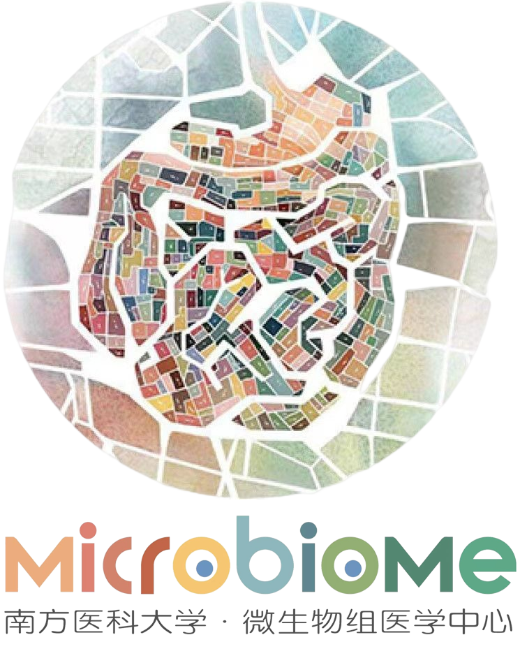

<!-- README.md is generated from README.Rmd. Please edit that file -->

```{r, include = FALSE}
knitr::opts_chunk$set(
  fig.path = "man/figures/REAMED-",
  message = FALSE,
  warning = FALSE
)
```
#  CMAP: CALM-base Microbiome Analysis Platform  

`CMAP` is an interactive online website designed to help researchers without a bioinformatics background quickly analyze microbiome data. It includes a mature 16S data analysis module and a Metagenomic analysis module that is currently under development.

For details, please click <http://www.cmap-zjyy.com:10548/>

##  :hammer: Analysis modules

ToDo

##  :runner: Author
- [Lang Zhou](https://github.com/nyzhoulang)  Creator & Maintainer
- [Jiaxuang Wang](https://github.com/wangjiaxuan666) Contributor

**ZJJY-Bioinformatics**  <https://github.com/ZJJY-Bioinformatics>

**Microbiome Medicine Center, Division of Laboratory Medicine, Zhujiang Hospital, Southern Medical University, Guangzhou, Guangdong province, China**

- [Li Zhan](https://github.com/SMUZhanLi)  Creator

**YuLab**  <https://yulab-smu.top/>

**Department of Bioinformatics, School of Basic Medical Sciences, Southern Medical University**


##  :bulb: Guide Videos

https://user-images.githubusercontent.com/46915370/209632660-3915cf97-54d8-4ea9-9123-22f4426ab3af.mp4
