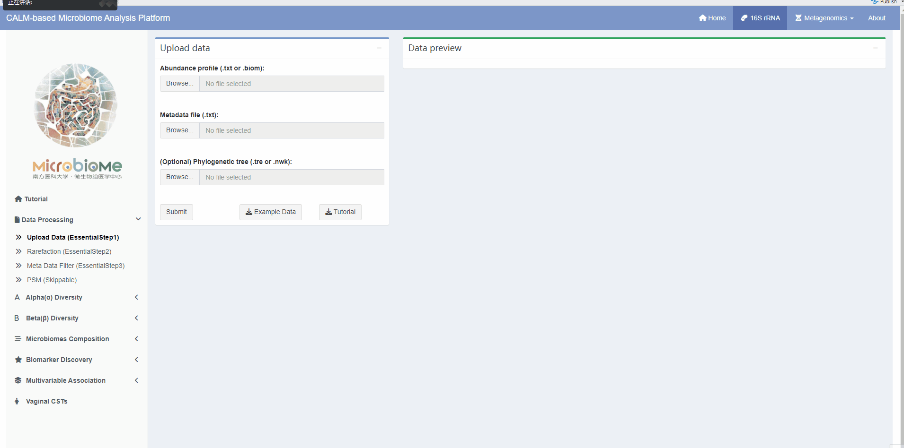
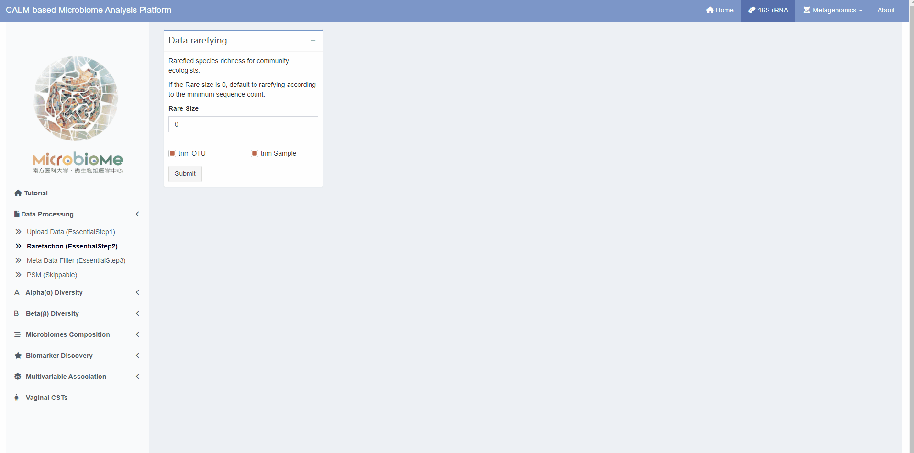
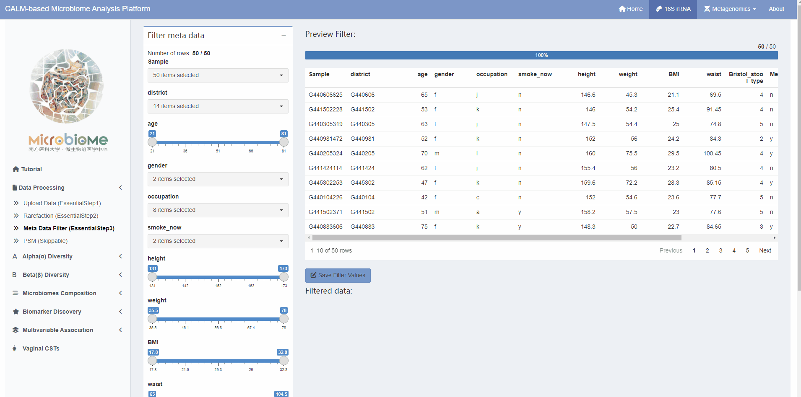

*CALM-based Microbiome Analysis Platform (CMAP)* is an interactive app for analysis of Microbiome datasets.

## Data Upload Instructions

  

## Rarefaction

  

## Fiter

  

## Workflow Diagram

For a quick walkthrough have a look a the video below.
   
<iframe style = "display: block; margin: auto;" width="1280" height="720" src="https://user-images.githubusercontent.com/46915370/209632660-3915cf97-54d8-4ea9-9123-22f4426ab3af.mp4"></iframe>

