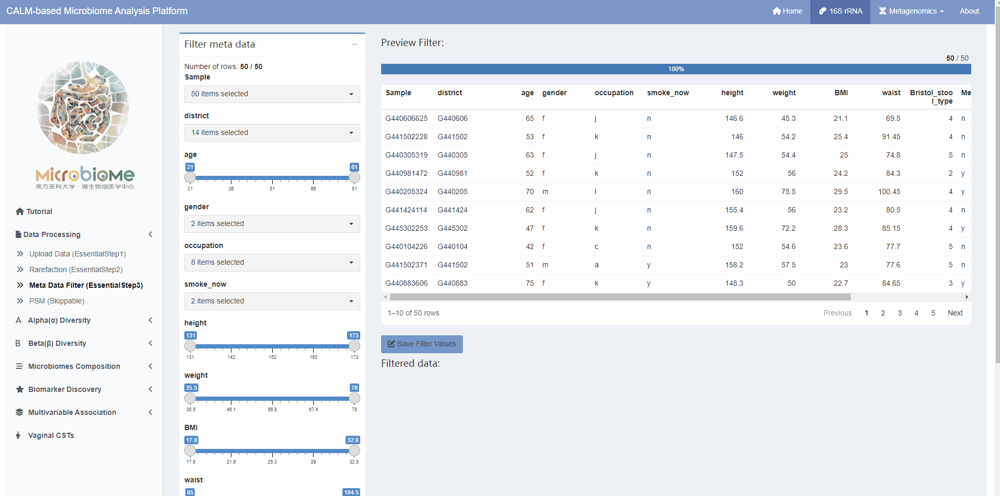
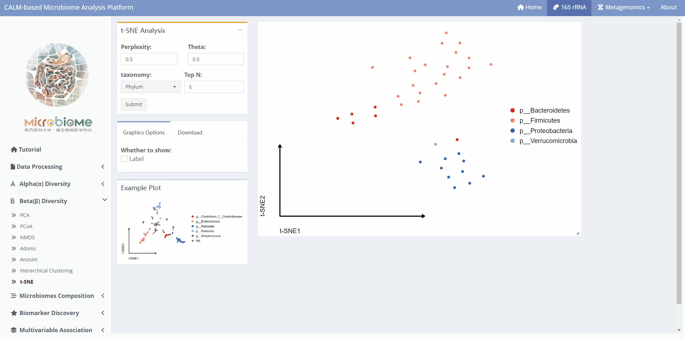

**CALM-based Microbiome Analysis Platform (CMAP)** is an interactive app for analysis of Microbiome datasets.

## Data Upload and Cleaning
Analysis can only be performed after completing three steps: **Data Upload, Rarefaction, and Meta Data Filter**.

### Data Upload Instructions

**1.** `Abundance file`:The OTU/ASV table should be in either `.biom` or `.txt` format. The first row (column names) should correspond to the sample names, and each subsequent row should represent the ID (row name) of the OTU/ASV. The last column should be named "taxonomy" and should contain the annotation information for the corresponding OTU/ASV row. Each column should be separated by a tab key (tab-separated format). 
 
**2.** `Meta file`: The metadata is a text file in tab-separated values format that contains information about sample grouping or environmental factors.The first column must be labeled as "#SampleID" and contains unique sample names.Sample names must not be duplicated within the "#SampleID" column. 
 
 **3.** `Tree file (optional)`: Typically with extensions `.tre` or `.nwk`, contains the evolutionary relationships among species. The presence of this file is necessary for conducting analyses involving species evolutionary relationships, such as calculating α-diversity using the PD index or β-diversity using the Unifrac distance. Without this file, analyses that rely on species evolutionary relationships cannot be performed.  
 
**When the Data Preview window displays the data, it indicates that CMAP has successfully read the data.**

### Rarefaction

+ `Rare Size` refers to the specified rarefaction threshold for rarefaction. If it is set to 0, the rarefaction will be performed based on the minimum sequence count. 
+ `Trim OTU` refers to whether to remove OTUs from the analysis. 
+ `Trim Sample` refers to whether to remove samples with a sequence count less than the "Rare Size" value. 

**The visualization on the right side allows you to compare the sample data before and after rarefaction.**

### Meta Data Filter

After filtering the data, it is necessary to click on `Save Filter Values` to save the filtered data.

## Alpha Diversity
### Alpha index

### Multi-group Comparison

### Rarefaction Curve

## Beta Diversity
### PCA/PCoA/NMDS

### Adonis

### Hierarchical Clustering

### t-SNE

## Microbiomes Composition
### Compositions-Group

### Compositions-Samples

### Abundance Comparision

## Biomarker Discovery
### LEfSe

### Diff-bar plot

### Diff-Abundance plot

## Multivariable Association
### CCA/RDA

## Vaginal CSTs

## Workflow Diagram

## Instructional video
For a quick walkthrough have a look a the video below.
 

<video width="640" height="360" controls>
  <source src="https://user-images.githubusercontent.com/46915370/209632660-3915cf97-54d8-4ea9-9123-22f4426ab3af.mp4" type="video/mp4">
</video>

